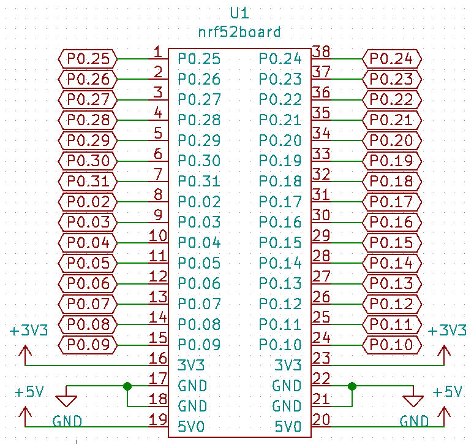
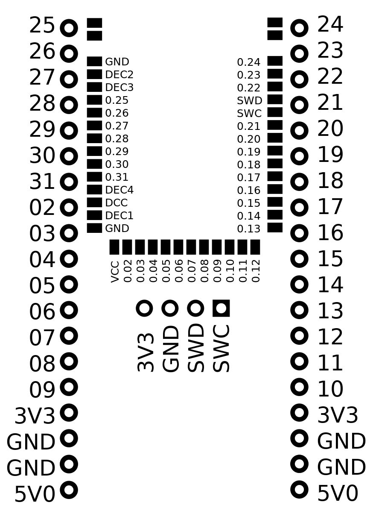

# Board pinout

See tables below

|pin|usage|usage|pin|
|---|-----|-----|---|
|  1|P0.25|P0.24| 38|
|  2|P0.26|P0.23| 37|
|  3|P0.27|P0.22| 36|
|  4|P0.28|P0.21| 35|
|  5|P0.29|P0.20| 34|
|  6|P0.30|P0.19| 33|
|  7|P0.31|P0.18| 32|
|  8|P0.02|P0.17| 31|
|  9|P0.03|P0.16| 30|
| 10|P0.04|P0.15| 29|
| 11|P0.05|P0.14| 28|
| 12|P0.06|P0.13| 27|
| 13|P0.07|P0.12| 26|
| 14|P0.08|P0.11| 25|
| 15|P0.09|P0.10| 24|
| 16|3V3  |3V3  | 23|
| 17|GND  |GND  | 22|
| 18|GND  |GND  | 21|
| 19|5V0  |5V0  | 20|

Programming header pinout
-------------------------

|pin|usage|
|---|-----|
|1|SWC|
|2|SWD|
|3|GND|
|4|3V3|

Module pinout
-------------

|Left|Central|Right|
|----|-------|-----|
|0 GND|-|43 GND|
|1 GND|-|42 GND|
|-|-|-|
|2 GND|16 VCC|41 0.24|
|3 DEC2|17 0.02|40 0.23|
|4 DEC3|18 0.03|39 0.22|
|5 0.25|19 0.04|38 SWD|
|6 0.26|20 0.05|37 SWC|
|7 0.27|21 0.06|36 0.21|
|8 0.28|22 0.07|35 0.20|
|9 0.29|23 0.08|34 0.19|
|10 0.30|24 0.09|33 0.18|
|11 0.31|25 0.10|32 0.17|
|12 DEC4|26 0.11|31 0.16|
|13 DCC|27 0.12|30 0.15|
|14 DEC1|-|29 0.14|
|15 GND|-|28 0.13|
