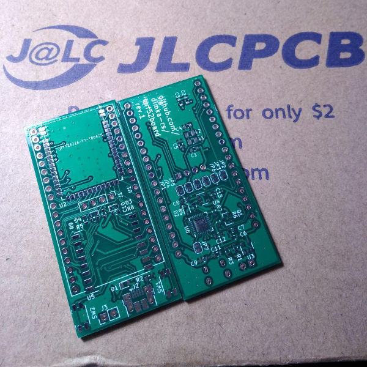
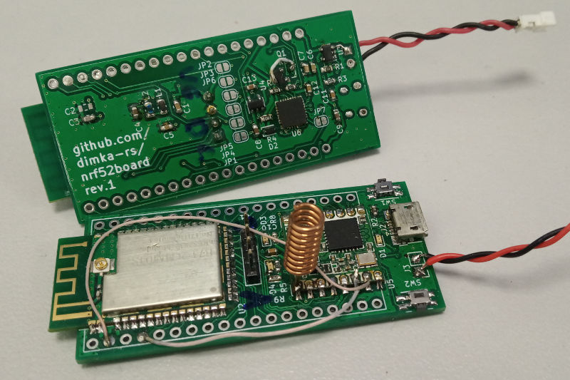

# NRF52 + LoRa dev board

## TODO / known issues
- Fix Q1 footprint
- Add separate LoRa DIO to NRF52 connections
- Add USB ESD protection
- Add LoRa IPX/UFL connector

## Components
- [NRF52 module E73-2G4M04S](https://www.aliexpress.com/item/32820692238.html) 
- [LoRa module RFM95W](https://www.aliexpress.com/item/32811523237.html)
- USB-UART CP2102
- LDO LP5907MFX-3.3
- LiPo charger MCP73831-2-OT

[See board pinout](pinout.md)

Board images:

